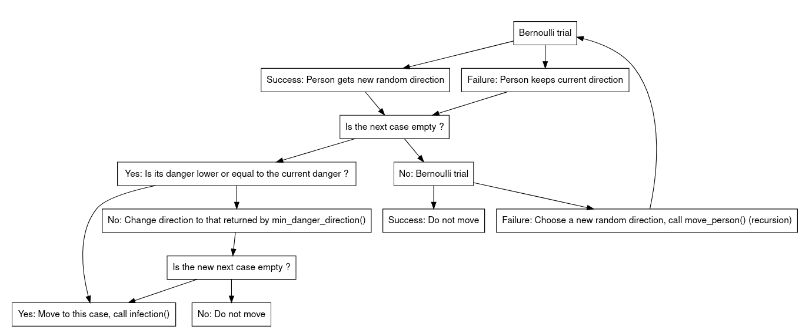
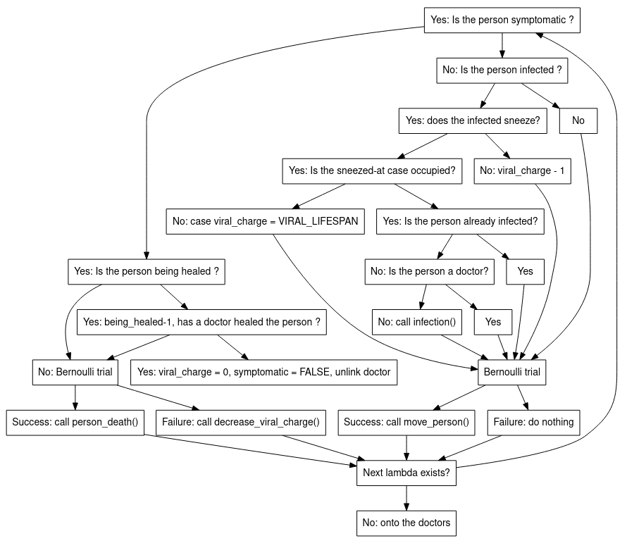

```{r setup, include=FALSE}
knitr::opts_chunk$set(echo = TRUE)
```

# Introduction

Dans le cadre de notre formation M1BIBS nous a été assigné un projet de programmation C dont l'énoncé peut se trouver [_ici_](https://github.com/gmagannaDevelop/TousAntiCovid/blob/main/enonce.pdf).

## Structures de Données

Pour cette partie, nous avons hésité entre utiliser des tableaux comme l'énoncé
le proposait, surtout car ceci était une structure que nous avions étudié et 
utilisé pendant le cours. Or, quand on y pensait cette structure était sous-optimale
pour les raisons suivantes :

* **Le caractère dynamique de la population** :  Quand la maladie causée par un
virus peut être mortelle

## Algorithmique

*Dans cette partie, nous allons nous intéresser à quelques algorithmes intéressants et expliquer plus en détails le fonctionnement de la simulation.*

### L'infection, la fonction `infection()`

Cette fonction a été implémentée à postériori afin de simplifier les fonction `global_update()`, `move_person()` et `move_doctor()`. 

La fonction vérifie dans un permier temps si la case dans laquelle va se produire l'infection est effectivement occupée par un virus et si la personne qui va se faire infecter n'est pas déjà infectée. Si tel est le cas, alors la personne deviendra infectée, on modifie sa `viral_charge` avec la valeur `MEAN_INFECTION_LENGTH`. La personne deviendra symptomatique si l'épreuve de Bernoulli de paramètre `P_SYMPTOMATIC` réussi. Enfin, si elle réussi, on ajoutera un gradient de danger autour de la personne et on retirera sa capacité de soin si c'est un soignant.

### Le gradient de danger, les fonctions `add_danger()` et `rm_danger()`

Ces deux fonctions sont quasi-identiques, elles auraient pu être fusionnées en une seule avec l'utilisation d'un argument supplémentaire qui aurait multiplié `DANGER_CLOSE` et `DANGER_FAR` par -1.

Cette fonction n'a de remarquable que la généralisation de la formule permettant de calculer les coordonnées de n'importe quelle case à partir des coordonnées d'une case donnée dans une matrice sans bord.

De plus, on peut noter que le choix des valeurs de gradient n'a pas été fait au hasard. En effet, nous nous sommes rendus compte qu'avoir une valeur de `DANGER_CLOSE` = 2 et de `DANGER_FAR` = 1 comme suggéré dans l'énoncé nécessitait des vérifications supplémentaires. En effet, un soignant qui se déplace vers les cases de gradient les plus important pourrait se déplacer vers une telle case, mais qui n'est pas en contact direct avec un malade. C'est pourquoi nous avons décidé de prendre une valeur de `DANGER_CLOSE` 100 fois supérieure à celle de `DANGER_FAR`. Ainsi, lorsque la case sur laquelle un soignant se trouve à une valeur de gradient de danger supérieure à `DANGER_CLOSE`, nous avons la certitude qu'il se trouve au contact d'un malade.

### La mort d'une personne, la fonction `person_death()`

Cette fonction est d'une importance cruciale dans notre programme. En effet, lors de la mort d'une personne, il faut vérifier si cette personne était symptomatique et si cette personne n'était pas en train de se faire soigner. Dans ce cas on enlève le gradient de danger puisqu'il est présent.

De plus, puisque nous travaillons avec des listes chaînées, la mort d'une personne signifie qu'il faut enlever ce maillon de la liste chaînées, procédure effectuée dans la sous-fonction `remove_person_from_sll()`.

### Choisir une direction en fonction du gradient, les fonctions `max_danger_direction()` et `min_danger_direction()`

Ces deux fonctions ont une algorithmique totalement similaire mais l'une sera utilisée dans `move_doctor()` pour aller vers les cases de gradient de danger les plus importants, tandis que l'autre sera utilisée pour `move_person()` pour aller vers les cases de gradient de danger les moins importants.
De plus, cette fonction renvoie la direction d'une case vide de préférence, et s'il n'y a pas de case vide, elle renverra une autre case mais cela n'a pas d'importance.

Ainsi, elle fonctionne de la manière suivante. Pour toutes les `N_DIRECTIONS` vers lesquelles la personne peut se déplacer, on va stocker dans un tableau la liste des valeurs des dangers. De plus, on vérifie au préalable que les cases soient vides, si ce n'est pas le cas, la valeur de danger dans le tableau sera remplacée par `DUMMY_REJECT_MAX`, qui est une valeur négative, pour la fonction `max_danger_direction()` ou `DUMMY_REJECT_MIN`, qui est une valeur plus de 10 fois supérieure à celle de `DANGER_CLOSE`, dans la fonction `min_danger_direction()`. Grâce à cela, ces valeurs seront "ignorées" dans la suite de la fonction.

On itère à nouveau sur `N_DIRECTIONS` en parcourant le tableau que l'on a créé précédemment et on cherche la valeur la plus élevée (ou la plus faible). L'indice de cette valeur sera renvoyé et nous donnera ainsi la direction de la case libre ayant le gradient de danger le plus élevé (ou le plus faible).

### Le déplacement d'une personne, la fonction `move_person()`

Cette fonction, avec `move_doctor()` et `global_update()` fait partie des plus complexes et auraient nécessité des simplifications à l'aide de sous-fonctions notamment.

Elle suit la flowchart suivante:



Dans les premières versions de cette fonction, nous utilisions une fonction `opposite_direction()` pour fuir le gradient. Cette fonction utilisait une propriété assignées aux `N_DIRECTIONS`. En effet, un tableau de fonction permettait de trouver simplement la direction opposée.

| NW | N  | NW | W  | SE | S | SW | E |
|----|----|----|----|----|---|----|---|
| -1 | -2 | -3 | -4 | 1  | 2 | 3  | 4 |
| 0  | 1  | 2  | 3  | 4  | 5 | 6  | 7 |

On peut voir ici que les directions opposées sont de signes contraires.

### Le déplacement d'un soignant, la fonction `move_doctor()`

Cette fonction est algorithmiquement identique à la fonction `move_person()`, les deux fonctions auraient pu être fusionnées.
L'unique différence est que les soignants se déplacent en priorité vers les cases de gradient de danger les plus important. Ainsi, on verifie si le danger de la case candidate est supérieur ou égal à celui de la case actuelle et l'on appelle la fonction `max_danger_direction()` à la place de la fonction `min_danger_direction()`.

### Soigner un symptomatique grâce à un soignant, la fonction `find_and_link_patient()`

Cette fonction est l'une des dernières que nous avons implémentées. Pendant la majeure partie du développement de ce programme, les médecins n'étaient qu'en fait que des personnes normales mais qui adoraient aller vers les cases de gradient de danger important. Ils allaient droit à la mort.

Cette fonction est appelée dans `global_update()` lorsqu'un soignant se trouve sur une case ayant un gradient de danger supérieur ou égal à `DANGER_CLOSE`. Cela nous assure que le soignant se trouve au contact d'un malade. La fonction va donc chercher dans les cases autour du soignant un malade qui n'est pas déjà pris en charge par un soignant. Une fois qu'il l'a trouvé, on effectue un cross-référencement du docteur dans le patient et du patient dans le docteur pour les lier. De plus, on modifie `being_healed` à 2, signifiant que l'on a commencé les soins. Enfin, on efface le gradient de danger autour du malade afin d'éviter d'attirer d'autres soignants.

On peut alors se demander: pourquoi vérifier que le malade n'est pas déjà lié à un soignant puisque s'il l'était, alors le gradient de danger n'aurait pas été là, et donc le soignant n'aurait jamais été sur cette case et n'aurait jamais cherché de malade. En fait, il existe la possibilité que deux malades soient très proches, à une case ou moins de distance. Dans ce cas, un soignant peut être attiré par le gradient de l'un, mais choisir l'autre comme patient. Cette contrainte, ce lien unique entre soignant et patient permet d'éviter ce cas de figure.

### Fonctionnement général de la simulation, la fonction `global_update()`

Pour suivre un tour de simulation, il faut suivre la fonction `global_update()`. Cette fonction est appelée par la fonction `main()` à chaque tour de simulation.

Elle effectue plusieurs étapes, tout d'abord en prenant les personnes de la linked-list des lambdas les uns après les autres:



Dans cette flowchart, on a la présence de la fonction `decrease_viral_charge()` 
qui n'est plus présente dans notre programme. En effet, elle avait été ajoutée 
à l'instar de la fonction `infection()` dans le but de simplifier les fonctions 
`move_person()`, `move_doctor()` et `global_update()`. 
Cependant, bien que l'implémentation de `infection()` ait été un succès, 
celle de `decrease_viral_charge()` s'est montrée plus complexe. 
En effet, cette fonction permettait à un lambda ou un docteur infecté ou 
malade de guérir de lui-même si sa charge virale atteignait zéro.
Le problème était que cette guérison sans l'aide d'un soignant avait trop de 
contraintes en fonction de l'état de l'infecté. Ainsi, faire une sous-fonction
qui peut prendre en compte tous ces cas de figures était trop complexe, 
nous avons donc décidé d'abandonner ce projet.
Cependant, lors de la tentative d'implémentation de cette fonction, nous nous
sommes rendus compte que la mécanique de guérison sans soignant n'avait pas
lieu chez les symptomatiques qui étaient pris en charge par un soignant.

Une fois que l'on a fini d'itérer sur la linked-list des lambdas, on itère sur
la liste des soignants "doctors". Cette deuxième partie de `global_update()` 
fonctionne de manière très similaire à la première avec tout de même quelques 
différences clés. 
En effet, un soignant se trouvant sur une case de danger supérieur à 
`DANGER_CLOSE` n'effectue pas de mouvement et cherche dans un rayon de 1 case
un malade qui n'est pas déjà lié à un docteur à l'aide de la fonction
`find_and_link_patient()` dans laquelle on enlève le gradient de danger et on 
lie le patient avec son docteur et vice-versa.

Une fois que l'on a fait jouer les lambdas et les soignants, il ne reste plus qu'à parcourir toute la matrice pour diminuer la charge virale de 1 dans chaque case ayant une charge virale supérieure à 0.

Ainsi, on a maintenant une idée générale du fonctionnement global de la simulation.

