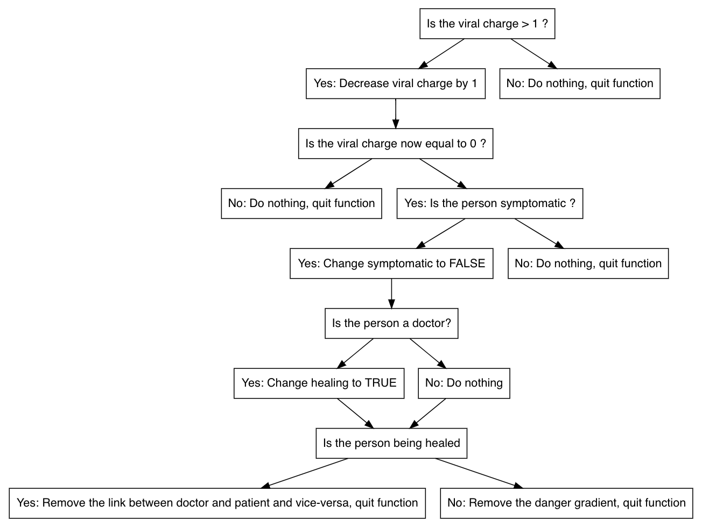

```{r setup, include=FALSE}
knitr::opts_chunk$set(echo = TRUE)
```

# Rapport résumé

## Problèmes

Un rapide résumé des  problèmes que l'on a rencontré ainsi que des solutions que l'on a trouvées,
implémentées ou essayé d'implémenter.

* **Indexation de la matrice de simulation** (résolu) : Lors des premiers essais de simulation, nous avons vérifié
la correspondance des références des listes chaînées vers le tableau de simulation et vice-versa. Ceci est
une contrainte d'intégrité très importante pour pouvoir faire la simulation, et elle n'était pas respectée.
Ceci était dû au fait que l'on indexait mal la matrice :
```{c matrice, eval=FALSE}
# erreur initiale
for (row=0; row<N; row++){
  for (column=0; column<M; column++){
    itable = &table[row*N + column];
  }
}
# façon correcte :
for (row=0; row<N; row++){
  for (column=0; column<M; column++){
    itable = &table[row*M + column];
  }
}
```

* **Itération sur les listes chaînées** (résolu) : L'implementation des listes chaînées que nous avons utilisée
a toujours un nœud terminal qui pointe vers `NULL`. Si l'on supprime une _personne_ de la liste chaînée,
son nœud reste dans la liste. L'appel `free(personne)` la supprime, mais son nœud reste.
Après la suppression de la personne, son nœud changera ses références vers la personne et le pointeur `next` du nœud suivant.
Ce dernier sera le nœud supprimé. Cela veut dire que si l'on supprime une personne lors de l'itération sur la liste,
la référence d'itération ne doit pas changer, car ceci _sauterait_ une personne de la liste.

* **Fermeture de la fenêtre graphique** (non résolu) : Le programme ne peut pas être arrêté en fermant la fenêtre graphique.
En fait, le bouton fermer ne fait absolument rien. Pour arrêter la simulation il faut entrer `ctrl + c` dans le terminal.
Ceci est dû à la version de SDL qui a été utilisée. Le _signal handling_ est simplifié et plus efficace dans la version
**SDL2** or, nous étions déjà familiers avec l'ancienne version et la fenêtre graphique n'était pas le but central de ce projet.

* **decrease_viral_charge()** (non résolu) : Lors de la relecture de notre code, nous avons voulu le simplifier et
regrouper les redondances dans de nouvelles sous-fonctions comme `infection()`. Cependant, cette fonction
devait aussi permettre la guérison si la charge virale arrivait à 0. Cette guérison devait suivre la flowchart Fig.1.
L'implémentation de cette fonction aurait nécessité plus de temps pour extraire du code tous les
endroits qu'elle devait remplacer.

{width=80%}

## Améliorations possibles

* Demander le paramètre de probabilité de mouvement au lieu de le définir comme un `macro`.
Ceci rendrait possible la visualisation de l'efficacité d'un confinement pour réduire le taux d'incidence.

* Ajouter un paramètre `prob_contamination` pour simuler l'emploi du masque et gestes barrières. Celui-ci
serait égal à 1 pour simuler le non-respect absolu des gestes barrières et inférieur pour simuler le cas contraire.
En plus, on pourrait ajouter un paramètre `prob_protection` pour indiquer le pourcentage de la population qui
respecte les gestes barrières.

* Sauvegarder les paramètres de la structure `src/datastructures::Epoch` à chaque tour de simulation
afin de pouvoir analyser les données de l'évoulution de l'épidémie. Ceci serait très intéressant
car nous pourrions comparer les résultats à l'évolution de la pandémie que l'on vit aujourd'hui.

* Simuler les agglomérations. On pourrait ajouter des objets avec un gradient d'attraction.
Puis nous pourrions comparer l'évolution de la simulation sans et avec les agglomérations.
Ceci aurait une grande valeur pour la vulgarisation.

* Fusion de certaines fonctions redondantes: `add_danger()` et `rm_danger()`, `move_person()` et `move_doctor()`
`min_danger_direction()` et `max_danger_direction()`. Il aurait aussi été possible de faire une sous fonction dans
`global_update()` qui aurait pu gérer les itérations sur les lambdas et sur les soignants.

* Implémentation de nouvelles sous-fonctions comme par exemple pour gérer le _sneezing_.
